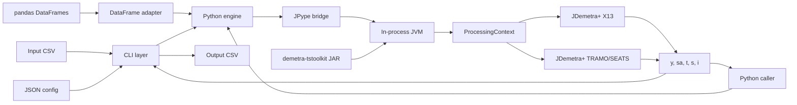

# demetrapy Design

## Purpose

`demetrapy` makes the JDemetra+ seasonal-adjustment engine available to
Python programs and shell workflows. It provides two entry points:

- A command-line interface that reads and writes CSV files.
- A Python function that accepts a numeric sequence and returns component
  series.
- A pandas function that adjusts one or more columns and accepts a separate
  pool of precomputed user-defined calendar variables.

The package does not reimplement seasonal-adjustment mathematics. It calls the
JDemetra+ X13 and TRAMO/SEATS implementations from `demetra-tstoolkit` through
an embedded Java Virtual Machine (JVM).

## Architecture



## Components

### CLI Layer

`src/demetrapy/cli.py` owns file-oriented behavior:

1. Parse the input, configuration, and output command-line arguments.
2. Read the configured date and value columns from CSV.
3. Convert the first ISO date into a JDemetra+ start year and period.
4. Call the engine with the numeric observations and adjustment settings.
5. Write the returned components to CSV using the original dates.

The CLI reports input, configuration, download, and processing failures on
standard error and exits with status `2`.

### Configuration

`src/demetrapy/config.py` represents configuration as an immutable
`AdjustmentConfig` dataclass. It supplies defaults, loads an optional JSON
object, maps configured regressor columns to arrays, and separates CSV-specific
settings from options passed to the engine.

Configuration controls:

- Input frequency and column names.
- The JDemetra+ method and preset.
- Preprocessing, automatic outlier, X11, and SEATS settings.
- Calendars, user regressors, outliers, interventions, ramps, and coefficients.
- Benchmarking.

### Python Engine

`src/demetrapy/engine.py` is the boundary between Python and Java. Its
public `adjust()` function:

1. Validates basic Python arguments.
2. Ensures the JDemetra+ JAR and JVM are available.
3. Resolves Java classes through JPype.
4. Clones the selected X13 or TRAMO/SEATS preset and applies overrides.
5. Builds an isolated `ProcessingContext` containing custom calendars and user
  `TsVariable` groups.
6. Converts Python values into JDemetra+ `TsData` objects.
7. Executes the selected processing factory with the context.
8. Converts either the five primary components or the complete typed result
  dictionary back into Python objects.

This layer is independent of pandas. Callers may pass lists, tuples, or values
extracted from a Series or DataFrame.

### DataFrame Adapter

`src/demetrapy/dataframe.py` provides `adjust_dataframe()`. It validates
regular `DatetimeIndex` domains, infers JDemetra+ frequency and start periods,
checks that a user-defined calendar pool covers the target domain, and runs
each target independently. The result uses `(series, component)` columns.

The complete calendar pool is registered as `TsVariable` objects in an
in-memory `ProcessingContext`. Only columns selected for the current target are
passed to `TradingDaysSpec.setUserVariables()`. JDemetra+ therefore sees the
original values and full variable domains while processing the relevant target
span.

Detailed mode converts all JDemetra `TsData` entries into domain-aware
`OutputSeries` values. The DataFrame adapter aligns those independent domains
on a union index and keeps scalar diagnostics and processing messages grouped
by target. Default mode remains a compact five-component DataFrame for
backward compatibility.

### Java Runtime and JAR

The engine pins `demetra-tstoolkit` to version `2.2.6`. By default, the JAR is
downloaded from Maven Central on first use and cached at:

```text
~/.cache/demetrapy/demetra-tstoolkit-2.2.6.jar
```

`DEMETRAPY_JAR` may point to an existing local JAR instead. The override is
validated before JVM startup.

JPype starts one JVM inside the Python process with the JAR on its classpath.
Subsequent adjustments in that process reuse the same JVM. A started JVM cannot
be reconfigured with a different JAR during the same process.

## Processing Flow

For a monthly series beginning in January 2019, Python supplies:

```text
values       = [101.2, 103.8, ...]
frequency    = Monthly
start_year   = 2019
start_period = 1
spec         = RSA4
```

The engine creates the equivalent Java time series, configures X13, and runs
the calculation. It returns a dictionary containing equal-length arrays:

| Key | Component |
| --- | --- |
| `y` | Original series |
| `sa` | Seasonally adjusted series |
| `t` | Trend component |
| `s` | Seasonal component |
| `i` | Irregular component |

The CLI combines these arrays with the original date column. The Python API
returns the dictionary directly, allowing callers to create a DataFrame or use
another data structure.

## Design Decisions

### In-process JVM

JPype avoids maintaining a separate Java service or subprocess protocol. Java
objects can be created directly while Python presents a small native API.

### Pinned JDemetra+ Version

Pinning the JAR makes calculations reproducible and prevents upstream API
changes from silently changing behavior.

### Standard-library CLI

CSV, JSON, argument parsing, downloads, and paths use the Python standard
library. JPype is the only required Python dependency. Pandas is optional and
used only by the DataFrame example.

### Presets with Overrides

Each calculation begins with a standard X13 or TRAMO/SEATS preset. Nested
settings are translated to corresponding method-specific Java objects. Unknown
settings fail early instead of silently changing the requested calculation.

### Isolated Processing Context

Each call receives its own JDemetra+ `ProcessingContext`. User series are
registered as named variable groups and custom holidays as named Gregorian
calendar providers. This prevents one adjustment's variables from leaking into
another adjustment in the same JVM.

### No Workspace XML Dependency

The package does not create, edit, or load JDemetra+ workspace XML. Specs,
variables, calendars, and processing contexts are assembled directly through
the Java API for each call. This preserves processing behavior without taking
on workspace persistence and GUI metadata semantics.

### User-Defined Trading Days

Ordinary user regressors and GUI-style UserDefined trading-day variables use
different Java paths. Ordinary regressors use `TsVariableDescriptor` entries.
UserDefined calendar weights are referenced by name from `TradingDaysSpec`.
When those names are present, built-in trading-days, working-days, and
leap-year effects are disabled. Easter remains independent and opt-in.

## Current Boundaries

- The CLI handles one regular series per invocation; the pandas API handles
  multiple target columns.
- Frequencies are monthly, quarterly, half-yearly, or yearly.
- The CLI derives the start period from the first date but does not currently
  verify that every following date is regularly spaced.
- The API exposes the main JDemetra+ 2.2.6 GUI specification families, but not
  arbitrary `InformationSet` fields, coefficient parameter-state arrays, or
  every diagnostic output table.
- The JVM is process-global and is not restarted between adjustments.

Future extensions can add richer diagnostics and lossless specification
serialization without changing the Python-to-Java boundary.